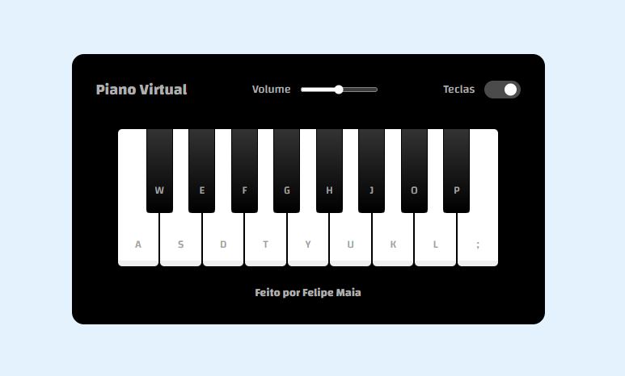

<h1 align="center"> # projeto Piano Virtual</h1>

Projeto feito 100% para testar habilidades.

<h1><a href="https://lp.rocketseat.com.br/devlinks/inscricao?utm_source=github&utm_medium=descricao&utm_campaign=capture-devlinks&utm_term=organic&utm_content=descricao-github-mayk-brito">Acesse o Piano Clicando aqui</a></h1>

 

  

## 🚀 Tecnologias

Esse projeto foi desenvolvido com as seguintes tecnologias:

- HTML e CSS
- JavaScript

Feito com ♥ by Felipe Maia :wave: [Acesse meu Linkedin](https://www.linkedin.com/in/felipe-maia-73070bab/)